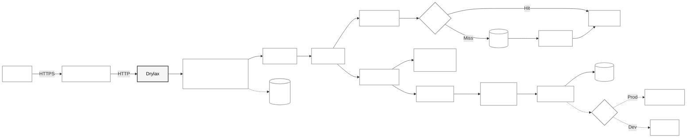
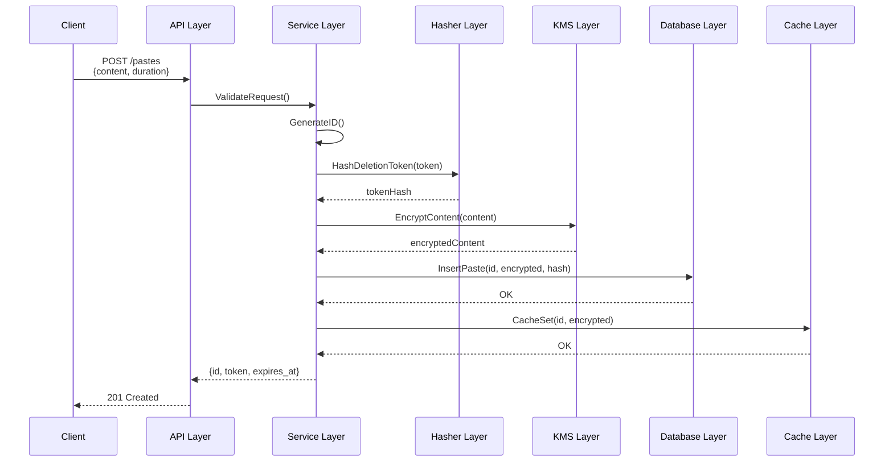
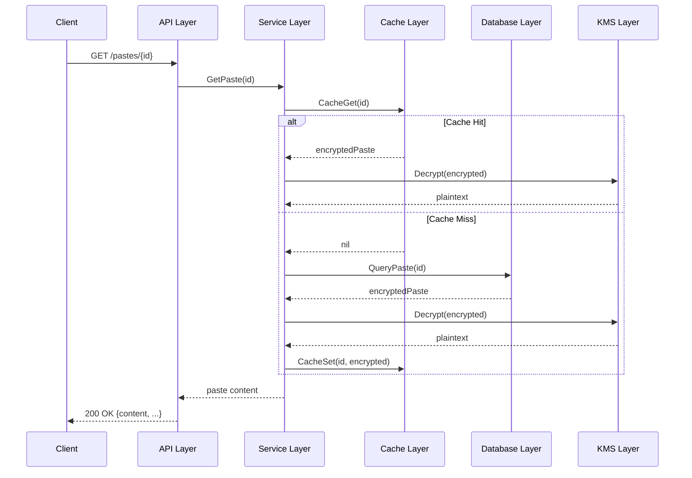
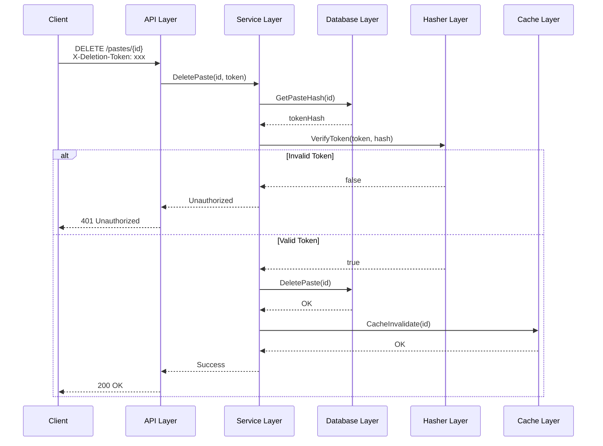

# Architecture Overview

This document explains the technical architecture of Drylax.

## System Architecture

Drylax uses a layered architecture with clear separation of concerns:


(You may need to zoom out a bit to see the full diagram unobstructed)

## Layer Descriptions

### API Layer (`svc/api/`)

Handles HTTP requests and responses.

**Responsibilities:**
- Route matching and dispatching
- Request parsing and validation
- Response serialization
- Error handling and status codes
- Middleware (rate limiting, logging)

**Key Files:**
- `srv.go`: Server initialization and middleware setup
- `hdl.go`: HTTP handlers for each endpoint
- `mw.go`: Middleware functions

**Flow:**
1. Request arrives at server
2. Middleware processes request (rate limit check, logging)
3. Router dispatches to appropriate handler
4. Handler calls service layer
5. Response serialized and returned

### Service Layer (`svc/svc/`)

Contains business logic and coordinates between layers.

**Responsibilities:**
- Paste creation, retrieval, deletion logic
- Encryption/decryption coordination
- Token generation and validation
- Expiration handling
- Transaction management

**Key Files:**
- `paste.go`: Core paste operations
- `paste_get.go`: Retrieval logic
- `paste_create.go`: Creation logic
- `paste_delete.go`: Deletion logic

**Example Flow (Create Paste):**
1. Validate input (size, duration)
2. Generate unique ID
3. Hash deletion token (via Hasher)
4. Encrypt content (via KMS)
5. Store in database
6. Cache encrypted paste
7. Return ID and token

### Database Layer (`svc/db/`)

Manages data persistence using SQLite.

**Responsibilities:**
- SQL query execution
- Connection pool management
- Transaction handling
- Schema migrations

**Key Files:**
- `db.go`: Database connection and initialization
- `paste.go`: Paste CRUD operations
- `schema.sql`: Database schema

**Schema:**
```sql
CREATE TABLE pastes (
    id TEXT PRIMARY KEY,
    encrypted_content BLOB NOT NULL,
    deletion_token_hash TEXT NOT NULL,
    created_at INTEGER NOT NULL,
    expires_at INTEGER NOT NULL
);

CREATE INDEX idx_expires_at ON pastes(expires_at);
```

**Security:**
- All queries use parameterized statements (no SQL injection)
- Prepared statements cached for performance
- Timeouts on all operations

### Cache Layer (`pkg/cache/`)

LRU (Least Recently Used) in-memory cache for performance.

**Responsibilities:**
- Cache frequently accessed pastes
- Automatic eviction of old entries
- Thread-safe operations
- Cache invalidation on delete

**Implementation:**
- Fixed size (configured by `LRU_CACHE_SIZE`)
- Evicts least recently used when full
-Thread-safe via mutex
- Cache keys are paste IDs

**Cache Hit Flow:**
1. Check cache for paste ID
2. If found, return immediately (skip database)
3. If not found, query database and cache result

### KMS Layer (`pkg/kms/`)

Handles encryption key management and encryption operations.

**Responsibilities:**
- Data Encryption Key (DEK) generation
- Key Encryption Key (KEK) management
- Encrypt/decrypt operations
- Key rotation support
- Multiple provider support (Vault, AWS, local)

**Key Concepts:**

**Envelope Encryption:**
1. Generate random DEK for each paste
2. Encrypt paste content with DEK (AES-256-GCM)
3. Encrypt DEK with KEK (managed by KMS)
4. Store encrypted DEK with paste

**Providers:**
- **Local**: Uses hardcoded key from config (simplest, less secure)
- **Vault**: Uses HashiCorp Vault transit engine
- **AWS KMS**: Uses AWS Key Management Service

**Key Files:**
- `kms.go`: KMS interface and envelope encryption
- `env.go`: Local key provider
- `vault.go`: Vault provider  
- `kek_cache.go`: KEK caching for performance
- `context.go`: Encryption context (AAD) for confused deputy protection

**Security Features:**
- Encryption context (Additional Authenticated Data)
- Key caching with TTL
- Fail-closed mode (refuses operation if KMS unavailable)
- Legacy compatibility for old formats

### Hasher Layer (`svc/auth/`)

Performs password hashing using Argon2id.

**Responsibilities:**
- Hash deletion tokens securely
- Verify token hashes (constant-time)
- Pepper application
- Worker pool management

**Implementation:**
- Argon2id algorithm (memory-hard, GPU-resistant)
- Worker pool for concurrent hashing
- Queue for pending hash jobs
- Timeout protection (5 seconds)

**Worker Pool:**
```go
jobQueue (chan) -> Workers (goroutines) -> Results (chan)
```

- Multiple workers process hashing in parallel
- Queue prevents overload
- Timeout ensures responsiveness

**Security:**
- Constant-time comparison (prevents timing attacks)
- Pepper added to all hashes (prevents rainbow tables)
- Unique salt per hash (Argon2 built-in)

### Utility Layer (`svc/util/`)

Provides supporting utilities.

**IP Hasher (`ip_hasher.go`):**
- Hashes client IPs before storage
- Key rotation support
- Privacy protection (original IP not stored)
- Used for rate limiting

**Other Utilities:**
- Logging helpers
- Context utilities
- Error wrapping

## Data Flow

### Creating a Paste



### Retrieving a Paste



### Deleting a Paste



## Concurrency Model

### Goroutines

Drylax uses goroutines for concurrent operations:

**Worker Pools:**
- Hasher workers: Configurable count (default 128)
- Database workers: Connection pool (default 25)
- HTTP handlers: New goroutine per request (Go standard)

**Synchronization:**
- Mutexes for cache access
- Channels for worker communication
- Context for cancellation

**Example (Hasher Pool):**
```go
// Initialize workers
for i := 0; i < workerCount; i++ {
    go h.worker() // Start worker goroutine
}

// Submit job
h.jobQueue <- hashJob{password, responseChan}

// Worker processes
job := <-h.jobQueue
hash := argon2.Hash(job.password)
job.responseChan <- hash
```

### Thread Safety

**Safe Operations:**
- Database queries (SQLite connection pool)
- Cache access (mutex protected)
- Hasher operations (channel-based)
- KMS operations (stateless)

**Tested:**
- Race detector (`go test -race`)
- Concurrency tests verify no deadlocks or data races

## Security Architecture

### Defense in Depth

Multiple layers of security:

1. **Network Layer**: HTTPS, rate limiting
2. **Application Layer**: Input validation, SQL injection protection
3. **Data Layer**: Encryption at rest, hashed IPs
4. **Access Control**: Deletion tokens, replay protection

### Encryption Flow

```
Plaintext → AES-256-GCM(DEK) → Ciphertext
DEK → KMS.Encrypt(KEK) → Encrypted DEK

Storage: [Encrypted DEK | Ciphertext | Auth Tag]
```

**Properties:**
- Authenticated encryption (AEAD)
- Unique DEK per paste
- KEK never touches application (managed by KMS)
- Encryption context prevents confused deputy attacks

### Token Security

**Deletion Tokens:**
1. Generate cryptographically random token
2. Hash with Argon2id + pepper
3. Store only hash
4. Verify in constant time

**Properties:**
- Cannot derive original token from hash
- Rainbow table attacks prevented (pepper + salt)
- Timing attacks prevented (constant-time comparison)
- Replay attacks prevented (expiry + tracking)

## Performance Considerations

### Caching Strategy

**What to Cache:**
- Encrypted pastes (frequently accessed)
- Not cached: Deletion token hashes (rarely accessed)

**Cache Size:**
Default 1000 entries, configurable. Tune based on:
- Available memory
- Paste access patterns
- Average paste size

### Database Optimization

**Indexes:**
- Primary key on `id` (fast lookups)
- Index on `expires_at` (fast cleanup queries)

**Connection Pooling:**
- Reuse connections (avoid setup overhead)
- Limit concurrent connections (prevent overload)

**Prepared Statements:**
- Cached query plans
- Faster execution
- Prevents SQL injection

### Hashing Performance

**Worker Pool:**
- Parallel hashing on multiple cores
- Queue prevents memory exhaustion
- Timeout prevents indefinite waiting

**Argon2 Tuning:**
Higher `ARGON2_TIME` and `ARGON2_MEMORY` = more secure but slower.
Balance security vs performance based on hardware.

## Monitoring and Observability

### Logging

**Structured Logging:**
All logs use JSON format with fields:
- `level`: debug, info, warn, error
- `msg`: Human-readable message
- `time`: ISO 8601 timestamp
- `caller`: Source file and line
- Context fields (request_id, paste_id, etc.)

**Log Levels:**
- `error`: Critical issues requiring attention
- `warn`: Potential issues
- `info`: Normal operations
- `debug`: Detailed debugging (not for production)

### Metrics

Current implementation logs metrics. Can be extended with:
- Prometheus for metrics collection
- Grafana for visualization
- Custom dashboards

**Key Metrics:**
- Request rate (per endpoint)
- Error rate
- Response latency (p50, p95, p99)
- Cache hit rate
- Database query time
- Hash operation queue depth

## Failure Modes

### Database Unavailable

- Application returns 500 to clients
- Logs error with request ID
- Does not crash (retries on next request)

### KMS Unavailable

**If `KMS_FAIL_CLOSED=true`:**
- Refuses to start if KMS unavailable at startup
- Returns 500 to encrypt/decrypt requests

**If `KMS_FAIL_CLOSED=false`:**
- Continues operating
- Logs warnings
- May allow unencrypted operations (development only)

### Cache Failure

- Falls back to database
- Logs warning
- Performance degraded but functional

### Hash Queue Full

- Returns error to client
- Logs warning
- Client should retry

## Testing Strategy

### Unit Tests

Test individual components in isolation:
- KMS encryption/decryption
- IP hasher determinism
- Cache eviction logic

### Integration Tests

Test component interactions:
- API endpoints
- Database operations
- Full paste lifecycle

### Load Tests

Validate performance under load:
- Sustained RPS
- Concurrent connections
- Large paste handling

### Security Tests

Test attack resistance:
- SQL injection
- Authentication bypass
- Timing attacks
- DoS protection

See `TEST_RESULTS_COMPLETE.md` for full results.

## Extension Points

### Adding New KMS Providers

Implement `pkg/kms/KMS` interface:

```go
type KMS interface {
    Encrypt(plaintext []byte) ([]byte, error)
    Decrypt(ciphertext []byte) ([]byte, error)
}
```

Example: Google Cloud KMS, Azure Key Vault

### Adding New Storage Backends

Implement `svc/db/Database` interface for:
- PostgreSQL (multi-server deployments)
- MySQL
- MongoDB

### Adding Features

Potential extensions:
- Paste editing
- Password protection
- Syntax highlighting
- File uploads
- Custom domains

Extend service layer, add API endpoints, update schema.
